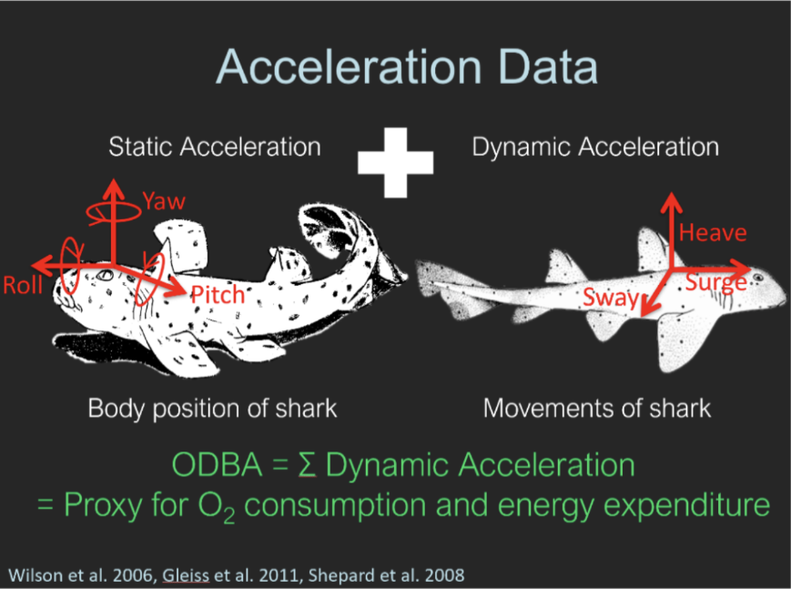

<!-- To be able to have continuous line numbers -->
```{=html}
<style>
body
  { counter-reset: source-line 0; }
pre.numberSource code
  { counter-reset: none; }
</style>
```

```{r setup, include=FALSE}
knitr::opts_chunk$set(echo = TRUE)
knitr::opts_chunk$set(warning = FALSE)
knitr::opts_chunk$set(cache = TRUE)
knitr::opts_chunk$set(message = FALSE)
```


# Tutorial Objectives {-}

The goal of this tutorial is to practice fitting hidden Markov models (HMMs) to time-series data, using accelerometer data as a case study. We will cover the following topics:

1. Fitting a basic HMM 

2. Assessing model fit

3. Incorporating covariates 

4. Interpreting results

5. Model selection 

## Packages

In this tutorial, we use the `hmmTMB` package (Michelot 2022) in R to fit HMMs. This package offers flexibility in incorporating covariate effects. However, many other software packages are available for fitting HMMs, each with different model formulations and a focus on specific data types. More information on `hmmTMB` can be found [here](https://arxiv.org/pdf/2211.14139). 
```{r, attr.source = ".numberLines"}
# Load R packages 
library(readr)
library(tidyverse)
library(hmmTMB)
```

# Data Background {-}

## Accelerometer Data {-}

Accelerometer devices measure up to three axes, which can be described relative to the body of the animal: longitudinal (surge), lateral (sway) and dorsoventral (heave). These devices are becoming more prevalent in the fields of animal biologging data as they provide a means of measuring activity in a meaningful and quantitative way. From tri-axial acceleration data, we can also derive several metrics that summarize effort or exertion and relate acceleration to activity levels such as overall dynamic body acceleration (ODBA) and vectorial dynamic body acceleration (VeDBA).

```{r, fig.align='center', echo=FALSE}

```

ODBA and VeDBA can be used to reduce the dimensionality of three-dimension acceleration data while retaining important information, and are often used as proxies of energy expenditure. 

## Blacktip Reef Shark data {-}

In this tutorial, we will be analyzing four days' worth of acceleration data from a free-ranging blacktip reef shark in the Palmyra Atoll located in the central Pacific Ocean. The acceleration data was collected from a 117-cm female shark (*Carcharhinus melanopterus*) species using a multisensor package. This package was attached to the shark's dorsal fin and recorded three-dimensional acceleration data at a rate of 20 Hz. It also recorded depth and water temperature at a rate of 1 Hz. After four days, the package, which was equipped with a VHF transmitter, detached from the shark and was retrieved from the water surface (Papastamatiou et al. 2015). To assess the shark's behaviour, the authors calculated the average ODBA over 1-second intervals, resulting in a dataset comprising of 320,214 observations. Consequently, the variables in the dataset consist of time of day, water temperature (in Celsius), depth (in meters), and ODBA.

```{r, attr.source = ".numberLines"}
# Load data 
BlacktipB <- read_delim("BlacktipB.txt", 
                        delim = "\t", escape_double = FALSE, 
                        trim_ws = TRUE)

# View data
head(BlacktipB) 
glimpse(BlacktipB)
summary(BlacktipB$ODBA)
```

# Data processing {-}

High-resolution data is often preferred since it may capture fine-scale processes. However, a key drawback is the high autocorrelation among observations at finer time scales, which may violate the assumption of conditional independence between observations given the states. In this tutorial, we use 1-minute averaged depth, temperature, and ODBA values to reduce both autocorrelation between observations and the time required for model fitting. Additionally, we treat ODBA values larger than 2 as outliers and remove them from the analysis.

```{r}
# Process the data
BlacktipB_1min = BlacktipB %>% filter(ODBA <= 2) %>%            # Remove outliers
  mutate(Time = as.POSIXct(Time,format = "%m/%d/%Y %H:%M")) %>% # Transform into time object
  group_by(Time = floor_date(Time, unit = "1 min")) %>%         # Take 1-min averages
  summarise(ODBA_avg = mean(ODBA),
            temp_avg = mean(Temp),
            depth_avg = mean(Depth)) %>%
  ungroup() %>%
  mutate(Time = as.POSIXct(Time,format = "%Y-%m-%d %H:%M:%S")) %>%
  as.data.frame() 

BlacktipB_1min$Time <- as.character(format(BlacktipB_1min$Time, "%Y-%m-%d %H:%M:%S"))
write.csv(BlacktipB_1min, "blacktip_1min.csv", row.names = FALSE)
BlacktipB_1min <- read.csv("blacktip_1min.csv")
BlacktipB_1min <- BlacktipB_1min %>% mutate(Time = as.POSIXct(Time,format = "%Y-%m-%d %H:%M:%S"))
```

The 1-min average ODBA time series is shown below. 

```{r,echo=T, fig.height= 4, fig.width=12, attr.source = ".numberLines"}
BlacktipB_1min %>% 
  ggplot(aes(Time,ODBA_avg)) + 
  geom_line()  
```


# Fitting a Basic HMM

Our first goal is to fit a basic 2-state HMM to the 1-min avg ODBA.

Before doing so it's good to look at the data. This will help us decide what may be appropriate distributions and starting values.

```{r, attr.source = ".numberLines"}
hist(BlacktipB_1min$ODBA_avg, 
     breaks = 80, 
     main="Histogram of ODBA", 
     xlab = "ODBA_avg")
```

The histogram of the 1-minute average ODBA values suggests that the data follows a Gamma distribution, so we use this distribution to model the observations. The Gamma distribution can be parameterized in terms of its mean and standard deviation (SD).

To fit an HMM, we must select starting values for these parameters, which serve as the starting point for the numerical optimizer. Choosing reasonable starting values is crucial to avoid convergence to a local maximum rather than the true maximum likelihood estimate (MLE).

# MAM: check consitency, swithc between initial and starting values. Here I changed for starting. Please check throughout and the slides of Fanny/Arturo that we are consitent.

Several strategies can improve convergence to the MLE. One approach is to select starting values that are plausible based on the observed data. When fitting more complex models, such as those incorporating covariates, a useful strategy is to first fit simpler models and use their estimates to initialize more complex ones.

We begin by inspecting the observed data.

```{r, attr.source = ".numberLines"}
summary(BlacktipB_1min$ODBA_avg)
sd(BlacktipB_1min$ODBA_avg)
```

Since the observed values range from 0.02 to 0.40, we can choose the initial values for the mean of each state to be, for example, 0.05 and 0.09, with a standard deviation of 0.03 for both states.

```{r, attr.source = ".numberLines"}
# Set initial parameters
## For state 1 and 2
mu1 = c(.05,.09) 
sigma1 = c(.03,.03) 
```

In `hmmTMB`, the observation and hidden state model are defined using `Observation$new()` and `MarkovChain$new()`, respectively.

For the observation model, we set `n_states = 2` to specify a 2-state HMM. We define the distribution of `ODBA_avg` using `dists=list(ODBA_avg="gamma2")`, which fits a Gamma distribution parameterised in terms of its mean and SD (instead of shape and rate). The chosen starting values are then provided via the `par` argument.

```{r}
# Create observation model
obs1 <- Observation$new(n_states = 2,
                       dists = list(ODBA_avg="gamma2"),
                       par = list(ODBA_avg=list(mean=mu1, sd=sigma1)),
                       data=BlacktipB_1min)
```

For convenience, we fix the initial state distribution to the stationary distribution of the transition probability matrix (tpm), and use default starting values for the tpm, which are 0.9 along the diagonal and 0.1 elsewhere.

```{r}
# Creating hidden model
hid1 <- MarkovChain$new(n_states = 2,
                       initial_state = "stationary",
                       data = BlacktipB_1min)
```

With these components specified, the HMM can be specified using `$fit(silent=T)`.

```{r}
# Create and fit HMM object
hmm1 <- HMM$new(obs = obs1, hid = hid1)
hmm1$fit(silent=T)
```

# Checking Model Fit

We can assess the model fit by visualising the pseudo-residuals, which are a type of model residuals that account for the interdependence of observations. If the model fit is appropriate, a quantile-quantile (QQ) plot of the pseudo-residuals should follow a standard normal distribution and an autocorrelation plot should show no significance in lag. Pseudo-residuals can be calculated using the `$pseudores()`. 

```{r}
# Compute pseudo-residuals
pr <- hmm1$pseudores()
{qqnorm(pr$ODBA_avg)
abline(0, 1)}
acf(pr$ODBA_avg)
```

The QQ-plot shows some deviations from the diagonal line suggesting a lack of fit and the acf plot shows some residual autocorrelation. Incorporating covariates may improve fit and account for this autocorrelation.

# Incorporating Covariates 

Covariates can be added to either the transition probabilities (i.e., hidden model) or the state-dependent distribution (i.e., observation model). 

For example, let's consider incorporating a time-of-day (TOD) as a covariate. 

```{r}
# Add TOD covariate to dataframe
BlacktipB_1min$TOD = as.numeric(format(BlacktipB_1min$Time, "%H")) +
as.numeric(format(BlacktipB_1min$Time, "%M"))/60
```

We add this as covariate to the transition probabilities when we believe that the time-of-day may influence the probability of transitioning between states. To do so, we update the `formula` argument of `MarkovChain$new()` by specifying a formula that incorporates the `TOD` covariate.

```{r}
# Formula for hidden model
fhid = ~s(TOD, bs="cc")
```

Note: `~s(TOD, bs="cc")` is just a way to represent TOD using a cyclic spline.

```{r}
# Create hidden model
hid2 <- MarkovChain$new(n_states = 2,
                       formula = fhid,
                       initial_state = "stationary",
                       data = BlacktipB_1min)
```

We'll also have to update the `Observation$new()` and `HMM$new()` since we added a new column `TOD` to the dataframe. 

```{r}
# Create observation model
obs2 <- Observation$new(n_states = 2,
                       dists = list(ODBA_avg="gamma2"),
                       par = list(ODBA_avg=list(mean=mu1, sd=sigma1)),
                       data=BlacktipB_1min)
```

```{r}
# Create and fit HMM object
hmm2 <- HMM$new(obs = obs2, hid = hid2, init = hmm1)
hmm2$fit(silent=T)
```

Note: we can use the fitted simple HMM from earlier to initialise this HMM using the `init` argument.

Alternatively, we may add this as a covariate to the state-dependent distribution when we believe that the time-of-day may influence the observed acceleration (i.e., the 1-min avg ODBA values) within each state. 

Let's examine the effect of TOD on the mean parameter of the Gamma state-dependent distribution Similarly, we update the `formulas` argument of `Observation$new()`.

```{r}
# Formula for observation model
fobs = list(ODBA_avg = list(mean = ~s(TOD, bs="cc")))
```

```{r}
# Create observation model
obs3 <- Observation$new(n_states = 2,
                       dists = list(ODBA_avg="gamma2"),
                       par = list(ODBA_avg=list(mean=mu1, sd=sigma1)),
                       formulas = fobs,
                       data=BlacktipB_1min)
```

```{r}
# Create and fit HMM object
hmm3 <- HMM$new(obs = obs3, hid = hid1, init = hmm1)
hmm3$fit(silent=T)
```

# Interpreting Results

We can obtain the estimated parameters for states 1 and 2 by simply calling the fitted HMM object or `print_obspar()` and `print_tpm()` to print the estimated observation and transition probability parameters.

```{r}
# Print estimated parameters
hmm1
hmm1$print_obspar()
```

We observe that state 1 corresponds to relatively lower activity (i.e., lower 1-minute average ODBA), while state 2 represents higher activity.

```{r}
hmm1$print_tpm()
```

The probability of remaining in either states is much higher than the probability of transitioning between states.

Using `plot_dist()`, we can visualise the estimated state-dependent distributions.

```{r}
# Plot estimated state-dependent distribution
hmm1$plot_dist("ODBA_avg")
```

We observe that the low-activity distribution has higher density near zero, while the high-activity distribution shifts its probability mass toward higher (scaled) 1-minute average ODBA values.

Additionally, we can determine the most likely sequence of states given the observed data using the Viterbi algorithm via `viterbi()`. This sequence can then be visualized using `plot_ts()`.

```{r}
# Viterbi algorithm
BlacktipB_1min$hmm1_state <- factor(hmm1$viterbi())

# Proportion of the behaviour states during the observed period
table(BlacktipB_1min$hmm1_state)/length(BlacktipB_1min$hmm1_state)

# Plot of decoded states
hmm1$plot_ts("ODBA_avg")
```

Again, we observe that lower 1-min ODBA avg values are classified as state 1 (lower activity state) and higher values as state 2 (higher activity state). 

Similarly, we can determine the most probable state at a given time point using the forward-backward algorithm via `state_probs()`. 

```{r}
BlacktipB_1min$pr_s2 <- hmm1$state_probs()[,2]
ggplot(BlacktipB_1min, aes(Time, ODBA_avg, col = pr_s2)) +
geom_point() +
scico::scale_color_scico(palette = "berlin",
name = expression("Pr("~S[t]~"= 2)"))
```

There tends to be high uncertainty for observations with intermediate values and some with lower values.

For the HMM with covariates in the transition probabilities, we can plot the stationary state probabilities to examine how the likelihood of the shark being in each state varies throughout the day.

```{r}
# Plot stationary distribution
hmm2$plot("delta", var="TOD")
```

We observe that the shark is more likely to be in the low-activity state around midday and more likely to be in the high-activity state outside these hours.

For the HMM with covariates in the state-dependent distribution, we can visualize the estimated mean parameter of the Gamma distribution over time to assess how the expected 1-minute average ODBA varies throughout the day.

```{r}
# Plot of observation parameter
BlacktipB_1min$hmm3_state <- factor(hmm3$viterbi())
hmm3$plot("obspar", "TOD", i = "ODBA_avg.mean") 
```

We observe that the mean of the 1-minute averaged ODBA values varies with time of day for the high-activity state (state 2), with mean ODBA values within the state peaking around 21:00.

A similar effect of TOD is observed for the low-activity state (state 1), though the mean ODBA values exhibit less variability over time.


# Model Selection

The Akaike Information Criteria (AIC) provides a measure of the trade-off between model fit and complexity. It is commonly used as a model selection criterion to select for the most suitable model among a set of candidate models. Lower AIC scores indicate a better balance between model fit and complexity.

We can compare the AIC scores using the AIC function for our original HMM (`hmm1`), the added TOD covariate in the transition probabilities HMM (`hmm2`) and the added TOD covariate in the state-dependent mean parameters HMM (`hmm3`).


```{r}
# Compute AIC
data.frame(AIC(hmm1),
           AIC(hmm2),
           AIC(hmm3))
```

We observe that incorporating covariates in either the state-dependent distribution or transition probabilities results in a lower AIC. Among the models considered, `hmm3` has the lowest AIC, suggesting that it may be the most suitable for modeling this data.

Caveat: AIC and other model selection criteria are known to overestimate the true number of states required for an HMM. Additionally, they are not always the most reliable method for selecting the "best" model, as other factors such as interpretability and biological relevance should also be considered.

In the context of shark behaviour (or that of many other marine animals), plotting the depth timeseries coloured according to the most likely state sequence can help with interpretation, especially in combination with prior knowledge about the ecology of your study species.

```{r}
#Subset the data frame to include only the first day ()
BlacktipB_day1 <- BlacktipB_1min[1:1440,]

# Plot decoded states over depth 
ggplot(BlacktipB_day1, aes(x=Time, y=depth_avg))+
  geom_line(aes(colour = hmm1_state, group = 1))+
  ylab("Depth (m)")+
  guides(colour = guide_legend(title = "State"))+
  scale_y_reverse()+
  scale_color_manual(values = c("dodgerblue3","firebrick"))
```


# Exercises {-}

1. Reproduce the analysis from the blacktip reef shark data, but now consider three behavioural states instead of only two. For this, do an exploratory data analysis to try to set initial values for the state-dependent distribution parameters. Look at the pseudo-residual values and the ACF plot. Does the autocorrelation reduce when considering another behavioural state. Is there a noticeable difference in the ACF compared to the initial 2-state HMM?

2. For the 2-state HMM, try to incorporate other variables as covariates (consider the 1-minute average temperature and depth variables). Fit this new model with help from the code above. What are the AIC and the log-likelihood values? How are these different from the values related to the second model fitted. Based on the AIC, which model seems to be the “best”?


# References {-}

Michelot, T (2022) hmmTMB: hidden Markov models with flexible covariate effects in R. arXiv:2211.14139v2

Papastamatiou YP, Watanabe YY, Bradley D, Dee LE, Weng K, et al. (2015) Drivers of Daily Routines in an Ectothermic Marine Predator: Hunt Warm, Rest Warmer? PLOS ONE 10: e0127807. https://doi.org/10.1371/journal.pone.0127807


